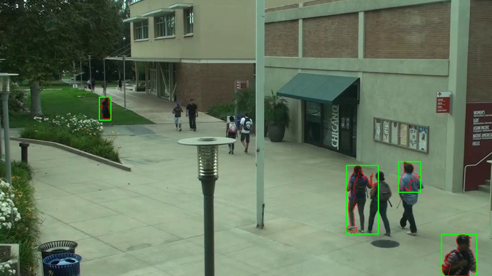

# 🚀 ATP Core Talent 2025
# 🎥 Core Talent AI Coder Challenge: Camera Movement Detection

**✨ Detecting Significant Camera Movement Using Image Recognition ✨**

---

## 🌟 Overview

Welcome to an advanced solution for detecting **significant camera movement**—such as tilting, panning, or shifting the entire camera—rather than just object movement within a scene. Leveraging state-of-the-art computer vision techniques, this project distinguishes between global (camera) and local (object) motion, all wrapped in a sleek, user-friendly web interface for seamless testing and demonstration.

---

## 🧠 Approach & Movement Detection Logic

- **Frame Differencing & Optical Flow:**
  - Consecutive frames are analyzed using frame differencing and dense optical flow (Farneback) to estimate global motion.
  - If the average optical flow magnitude surpasses a set threshold, the frame is flagged for significant camera movement.
- **Object Movement Detection:**
  - Background subtraction (MOG2) and contour analysis are employed to spot moving objects within the scene.
  - Frames with sufficiently large contours are marked as containing object movement.
- **Visualization:**
  - Camera movements are visualized with dynamic flow vectors.
  - Object movements are highlighted with bounding boxes and contours for clear insight.
- **Efficiency:**
  - Annotated frames are displayed instantly and not stored in memory, ensuring smooth performance even with long videos.
- **Efficiency & Memory Handling:**
  - **How I Dealt with Memory Issues:** Instead of storing all annotated frames in memory and displaying them in bulk at the end (which can cause memory overload for long videos or large datasets), each processed frame with detected movement is immediately displayed to the user. This real-time, per-frame visualization ensures that memory usage remains low and the app remains responsive, even with large or lengthy inputs.
  - Detected indices are updated live at the top of the app for real-time feedback.

---

## ⚡️ Challenges & Assumptions

- **Assumptions:**
  - The input is a sequence of images or a video simulating a fixed camera, with some frames containing significant camera movement.
  - Minor object/background motion should not trigger camera movement detection.
- **Challenges:**
  - Accurately distinguishing between global (camera) and local (object) motion, especially in complex scenes.
  - Maintaining efficient memory usage for long videos or large image sequences.
  - Delivering real-time, interactive feedback in the web interface.

---

## 🛠️ How to Run the App Locally

1. **Clone the repository:**
   ```bash
   git clone https://github.com/yemreyekta/ATPTechCoreTalentRepo
   cd ATPTechCoreTalentRepo/camera-movement-detection
   ```
2. **Install dependencies:**
   ```bash
   pip install -r requirements.txt
   ```
3. **Run the Streamlit app:**
   ```bash
   streamlit run app.py
   ```
4. **Usage:**
   - Upload a video (mp4/gif) or a sequence of images.
   - The app will analyze the frames and display detected camera/object movements and their indices live.

---

## 🌐 Live Demo

🔗 [Live Demo (Streamlit Cloud)](https://atptechcoretalentrepo-yunusemreyekta.streamlit.app/)

---

## 🎬 Example Results

| Camera Movement Visual | Object Movement Visual |
|-----------------------|-----------------------|
|  |  |

---

## 🤖 AI Prompts / Chat History

- This project was developed with the support of AI prompts and iterative improvements:
1. Refactor the function detect_significant_movement to follow cleaner functional separation. Add preprocessing (e.g., grayscale conversion), frame differencing, and scoring as separate functions. Include docstrings and type hints for all new functions.
2. Implement a function using OpenCV ORB to compute keypoints and descriptors for each frame. Then compute matches between consecutive frames, estimate homography, and use the transformation magnitude to decide significant camera movement.
Return the index of frames where global motion exceeds a configurable threshold.
3. Enhance the movement detection by distinguishing object movement from camera motion.
Use keypoint matching and homography estimation between frames. If homography indicates global movement and frame differencing suggests local changes, classify the movement as camera-induced.
Return two separate lists: one for significant camera movement, another for local object changes.
4. Overlay matched keypoints or transformation vectors on the frames where significant camera movement is detected.
Create a helper function that annotates the image with visual feedback (e.g., matched points or bounding boxes), and return it alongside the detection result.
5. Enhance the Streamlit UI to include:
- A sidebar to adjust the movement threshold interactively
- A toggle to display visualized frames with overlays (e.g., keypoints or differences)
- A download button for exporting the list of detected frames
Make sure the app handles variable image sizes and grayscale inputs.
6. Write a README file according to developments.

---

## 📚 Citation & Credits

- Built with OpenCV, Streamlit, and PIL.
- Inspired by the [CameraBench Dataset](https://huggingface.co/datasets/syCen/CameraBench) for testing and benchmarking.
- Useful resources:
  - https://docs.opencv.org/3.4/d5/dab/tutorial_sfm_trajectory_estimation.html
  - https://hackmd.io/@lKuOpplzSUWLhLim2Z7ZJw/ryTpNXeGn

---
